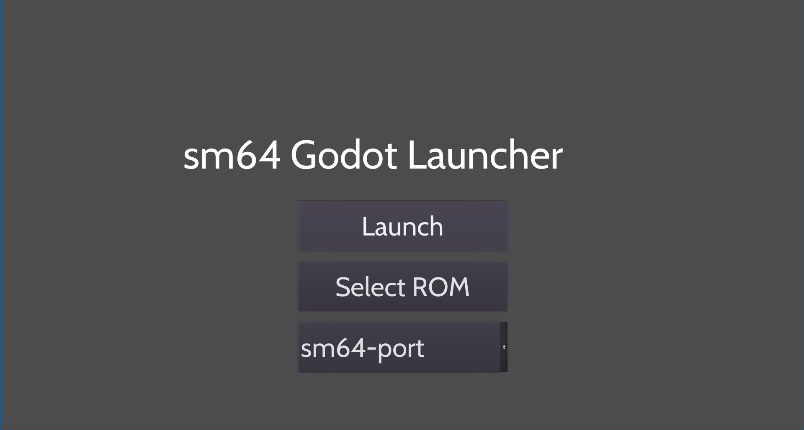

# sm64-Godot-Launcher
An launcher/builder for sm64pc-port and alike.
Made in the Godot Engine,currently only supports building sm64plus for Linux.
The launcher assumes that you have already installed the required [dependencies](https://github.com/MorsGames/sm64plus/wiki/Manual-Building-Guide).
# Contribution
You can contribute by forking the repo making the changes and opening an pull request.

